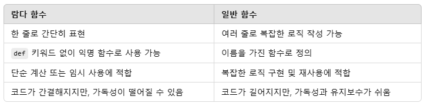
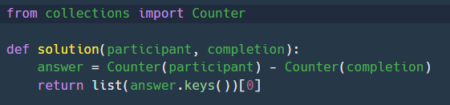
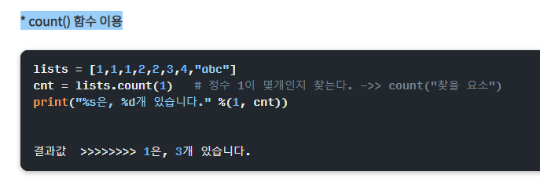
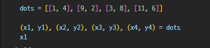
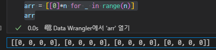

- 1126
```
- 단어.lower().split()
- 가장 많은 원소 카운트
  counts = collections.Counter(words)
  return counts.most_common(1)[0][0]    
```


- 1124

```
- isalnum()
  - 숫자인지 영문자인지 판단.
```
  - 람다함수의 이용 
  
  ```
  s = ['2 A','1 B','4 C','1 A']
  s.sort(key = lambda x: (x.split()[1], x.split()[0]))
  ```

- 1112
  - 리스트 삭제

    - del a[순서]
    - remove(지우려는 원소)

- 1111

```
- 리스트에서 특정원소 지우기
  - a.remove(min(a))
```

- 1104

```
from datetime import datetime

year, month, day = map(int, str(datetime.now().date()).split("-"))
year

# 2024

```

```
- 리스트의 차집합 구하는 법
```



```
리스트안에 중복 원소 갯수 세기

```



- 1103

  ```
  sorted
  answer = sorted(answer,key = lambda x: x[list_dict[sort_by]])
  배열하고 싶은 리스트 내에서 조건을 걸고 싶을떄
  ```

- 1029

  ```
  .str[:n]
  판다스 행에서 특정 글자를 자르고 싶을때
  ```

  ```
  np.where(조건, 참일 때의 값, 거짓일 때의 값)
  ```

- 1027

  ```
  - 딕셔너리 인덱스를 통해 여러번 나온 문자에 대해 가장 큰 인덱스 가져와서 계산하기
   last_seen = {}  # 문자와 마지막 인덱스 저장

    for idx, char in enumerate(s):
        if char not in last_seen:
            answer.append(-1)  # 첫 등장 시 -1 추가
        else:
            answer.append(idx - last_seen[char])  # 가장 가까운 거리 추가
        last_seen[char] = idx  # 마지막 등장 위치 갱신
  ```

  ```
  ord란 ordinal position의 약자로, 문자의 순서 위치 값을 의미한다.
  10진수 유니코드(Unicode)로 값을 변환
  chr이란 chracter의 약자로, 정수 값을 유니코드 문자로 변환

  ```

  ```
  replace_dict = {s[0]: s[1] for s in snippet}
  빠르게 딕셔너리 만들기
  ```

  ```
  - get() 메서드
  r_dict = {s[0]: s[1] for s in snippet}
  for i in sen:
      # 대치되는 단어가 있는 경우 대치, 없으면 원래 단어 사용
      answer.append(r_dict.get(i,i))
  return ' '.join(answer)
  ```

* 1026

  ```

  - 행렬의 합
    def solution(arr1, arr2):
    return [[a + b for a, b in zip(row1, row2)] for row1, row2 in zip(arr1, arr2)]

  ```

```
행렬의 합2
  def solution(matrix_A, matrix_B):
  answer = []
  for i in range(len(matrix_A)):
      row = []
      for j in range(len(matrix_A[i])):
          row.append(matrix_A[i][j]+matrix_B[i][j])
      answer.append(row)
  return answer
```

```

- 최대공약수 최소 공배수
  gcd_value = math.gcd(n, m)
  # 최소공배수 계산: (n \* m) // gcd_value
  lcm_value = (n \* m) // gcd_value

```

```

- counter
  from collections import Counter

def solution(X, Y): # 각 숫자의 빈도수를 카운팅
count_X = Counter(X)
count_Y = Counter(Y)

```

- 1023

```

이중 리스트의 원소를 받아오는 방법

```



```

- 좌표문제일때
  for i in range(len(wall)):
  for j in range(len(wall[i])):
  if wall[i][j] == "#":
  a.append(i)
  b.append(j)

```

```

- 0으로 찬 n \* n매트릭스 만들기

```



- 1021

```

swap
변수1, 변수2 = 변수2, 변수1

```

```

딕셔너리 키랑 값 동시에 보여주기

> > > for key, value in x.items():
> > > ... print(key, value)

```

- 1019

```

대소문자 바꾸는 함수:
print(input().swapcase())

```

- 1017

```

# 키와 값 리스트

keys = ['key1', 'key2', 'key3', 'key4', 'key5', 'key6', 'key7', 'key8', 'key9', 'key10']
values = ['value1', 'value2', 'value3', 'value4', 'value5', 'value6', 'value7', 'value8', 'value9', 'value10']

# 빈 딕셔너리 생성

my_dict = {}

# 키와 값을 대응하여 딕셔너리에 넣기

for i in range(len(keys)):
my_dict[keys[i]] = values[i]

# 결과 출력

print(my_dict)

```

- 1016

```

- 합성수
  output = 0:

합성수의 개수를 저장하는 변수로, 처음에는 0으로 초기화합니다.
for i in range(4, n + 1):

숫자 4부터 n까지의 숫자들을 검사합니다. 4부터 시작하는 이유는 2와 3은 소수이므로 합성수가 아니기 때문입니다.
for j in range(2, int(i \*\* 0.5) + 1):

여기서 j는 i를 나누는 수입니다. i의 제곱근까지만 검사하는 이유는, 합성수는 약수 쌍으로 이루어지며 제곱근보다 큰 약수는 이미 작은 약수에서 검사되었기 때문입니다. 예를 들어, 36의 약수는 6×6을 기준으로 1부터 6까지만 보면 되므로, 7 이상의 숫자는 굳이 확인할 필요가 없습니다.
if i % j == 0:

i가 j로 나눠떨어지면 합성수임을 뜻합니다. 즉, 약수 j가 존재하면 합성수로 판정합니다.
output += 1:

합성수를 찾았으므로 합성수 개수를 1 증가시킵니다.
break:

한 번이라도 나누어떨어지면 합성수임이 확정되므로 더 이상 검사를 하지 않고 내부 for 루프를 빠져나옵니다.
return output:

최종적으로 계산된 합성수의 개수를 반환합니다.

```

- 1014

```

- in : 실제 숫자가 포함되어 있느냐를 보려면 str형태로 바꾸어보면 좋음

```

- 1013

```

- 이중 리스트를 닥셔너리로 만듦
  def solution(snippet, message): # 메시지를 공백 단위로 단어 리스트로 변환
  words = message.split()

      # snippet을 딕셔너리로 변환
      snippet_dict = {abbr: full for abbr, full in snippet}

      # 각 단어를 순회하면서 대치가 필요한 경우 대치
      for i in range(len(words)):
          if words[i] in snippet_dict:
              words[i] = snippet_dict[words[i]]

```

```

- 정규표현식 및 join

import re

def solution(snippet, message):
m_list = re.split(r'(\s+|[!@#$%^&*().,?])', message)

    for i in range(len(m_list)):
        # 단어가 대치될 단어에 해당하는지 확인
        for pair in snippet:
            if m_list[i] == pair[0]:
                # 대치 목록에 있으면 해당 단어를 대치 단어로 변경
                m_list[i] = pair[1]

    # 대치된 단어 리스트를 다시 문자열로 합쳐서 반환
    return ''.join(m_list)

```

```

- 최대공약수 : math.gcd(a,b)

```

```

- 순회한 문자가 특정 문자를 포함하고 있는지 : all(c in '05' for c in str(num))

```

- 1012

```

여러개로 끊기
re.split(r'[!@#$%^&*().,? ]+', message)

```

```

sorted() 함수:

sorted() 함수는 파이썬 내장 함수로, 리스트를 정렬해 새로운 리스트를 반환합니다.
정렬 시 어떤 기준으로 정렬할지 결정하는 key 파라미터를 사용할 수 있습니다. 여기서 key로는 특정 함수(혹은 람다 함수)를 제공할 수 있습니다. 이 함수는 리스트의 각 원소에 적용되어, 그 값을 기준으로 정렬하게 됩니다.
lambda 함수:

lambda x: (abs(x - n), -x) 부분은 익명 함수(람다 함수)입니다. 이 함수는 리스트의 각 원소 x에 대해 (abs(x - n), -x) 튜플을 반환합니다.
이 튜플을 이용해 두 가지 기준으로 정렬하게 됩니다:
abs(x - n): x가 n으로부터 얼마나 떨어져 있는지(절대 거리)를 계산합니다. 거리가 가까울수록 우선순위가 높아집니다.
-x: 거리가 같은 경우, 더 큰 수가 먼저 오도록 내림차순으로 정렬하기 위해 -x 값을 사용합니다. 즉, 음수 기호를 붙여 더 큰 값이 우선 정렬되도록 합니다.

```

- 1008

```

array = [1, 2, 3, 3, 3, 4]
count = [0] \* (max(array)+1)
for i in array:
count[i] += 1

빈 0 리스트를 만들고 최대값 수만큼 만들면 숫자 범위만큼 0이 생김. 반복문으로 1씩 더하면 각 숫자의 출현 수를 셀 수 있음

```

- 1006

```

좌표를 가지고 문제를 푸는 경우
direction = [(-1, 0), (1, 0), (0, -1), (0, 1), (-1, -1), (-1, 1), (1, -1), (1, 1)]

> 방향 정하기 - 리스트로 만들어서
> danger*board = [[0] \* n for * in range(n)]
> 크기 만큼 다 0으로 찬 행렬 만들기

```

```

from collections import Counter
등장한 원소의 개수 세기

```

```

import math
a, b = 6, 15
math.lcm(a, b)
최소공배수 구하기

```

- 1003

```

- 숫자를 끊기
  list(map(int,str(order)))
- sorted로 끊어진 문자열
  ''.join(sorted(my_string.lower())) 이걸로 합칠 수 있음

```

- 0905

```

문자열에서 숫자만 찾고 싶을때, isdigit을 하면됨

```

- 0823

```

왼쪽에 오는 특정문자 제거
.lstrip('0')

```

- 0821

```

- .sort()를 사용하면 이를 실행하고 밑에서 리스트를 가지고 인덱싱을 해야 특정값을 가져올 수 있음.

```

- 0819

```

- 배열 내에서 공통이 되는 원소의 수를 찾을 때는 교집합을 활용하면 쉽게 찾을 수 있다.
- 딕셔너리
  - 빈 딕셔너리를 만들고 키와 벨류를 나중에 입력해도 그 딕셔너리 안으로 들어가게 된다.

```

- 0818

```

- not in을 잘 활용하면 안에 있는 것을 뺄 수 있음
- list(range(a,b))를 활용하면 1씩 추가된 리스트를 만들 수 있음
- .sort() => 리스트안에 문자를 정렬(알파벳이면 사전순)

```

- 0814

```

- 특정 문자를 빈 문자로 만들고 싶을 때, 문자열.replace(특정문자,"")
- if문 대신 딕셔너리를 잘 활용하는 것도 좋다
- 순서를 지정할때 전체에서 1을 빼고 싶으면 그냥 -1을 작성하면 됨

```

- 0808

```

- 슬라이싱 문제
- [시작:끝:간격]
- [::-1]
- 끝까지로 지정하고 싶으면 비워두면 됨->[n:] : n부터 끝까지
- 리스트 끼리는 그냥 += 로 더해주면 됨

```

- 0807

```

문자열1 in 문자열2
-> 포함되어 있는지 확인

```

```

- continue

for 문의 조건을 깨고 다음을 실행

```

- 0805

```

- enumerate(for 문에서 range 대신 사용)
  > > > for i, letter in enumerate(['A', 'B', 'C'], start=1):
  > > > ... print(i, letter)
  > > > ...
  > > > 1 A
  > > > 2 B
  > > > 3 C

```

```

```
